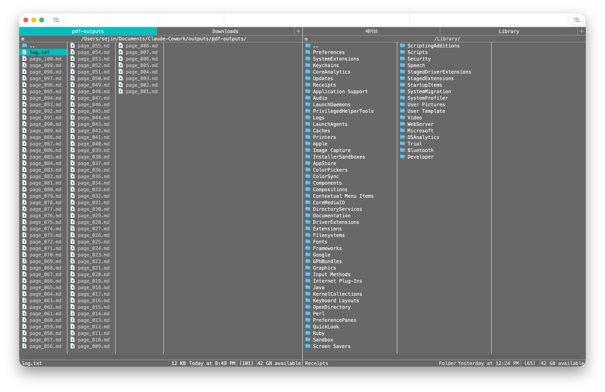

# Dos Navigator Theme for Nimble Commander

Norton Commander's blue and yellow are iconic — and that's exactly why I needed to leave.

[Nimble Commander](https://magnumbytes.com/) does a faithful job recreating the classic theme, and for most people it's perfect. But after long working sessions, I started looking for something quieter: less saturation, less contrast, more nostalgia.

I found my answer in **Dos Navigator 1.5**, an orthodox file manager first released in 1991 that quietly chose its own palette instead of copying Norton Commander's. Its default colors are easy on the eyes, fast to scan, and pleasantly retro.

This theme ports those colors to Nimble Commander.

## Installation from GitHub

1. Download [`Dos Navigator.json`](./Dos%20Navigator.json).
2. Open **Settings**, then **Themes**.
3. Open the **Theme** dropdown at the bottom and choose **Import theme…**.
4. Select `Dos Navigator.json`.
5. Select **Dos Navigator** in the **Theme** list.

## Credits

Color values from the Dos Navigator 1.5 default scheme. UI elements tuned for Nimble Commander.

## License

MIT
